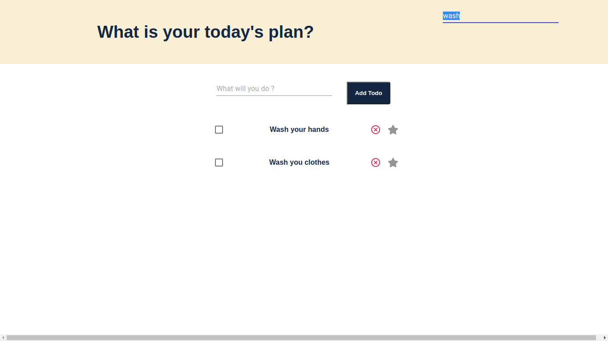
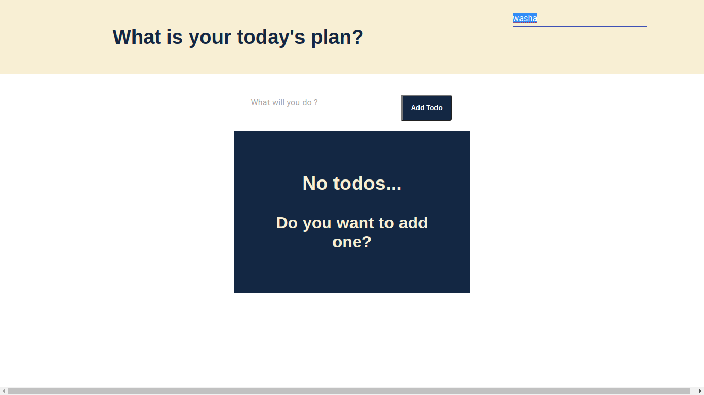

# To-do-list App by Ahmet Yasin

<h2>App functions:</h2>
<ul>
<li>- Search bar to find your precies todo</li>
<li>- Text field to add a new todo</li>
<li>- Check Box to make sign your todo completed</li>
<li>- Click on todo and edit easily</li>
<li>- Delete button to delete todo</li>
<li>- Star icon to attempt it is very important so you can see that at top side</li>
</ul>

<h2>Deployment: </h2>
Now the online deployment of the project is available; 
Just click [here](https://mernstacktodolist.herokuapp.com/) in order to see todo-list app!

<h2>Getting Started with files</h2>

To get started you can simply clone the repo and install the dependencies in the root `folder`

| Steps   | with [NPM](https://www.npmjs.com/) |
| ------- | ---------------------------------- |
| Install | `npm install`                      |
| Run     | `npm run dev`                      |

<h2>Techs</h2>
<h4>MERN Stack</h4>
<ul>
  <li>MongoDB - document database</li>
   <li> Express(.js) - Node.js web framework</li>
  <li> React(.js) - a client-side JavaScript framework</li>
  <li> Node(.js) - the premier JavaScript web server</li>
</ul>
    
<h2>App Sketch</h2>






<h2>File tree</h2>

```
├── client
│   ├── build
│   │   ├── asset-manifest.json
│   │   ├── favicon.ico
│   │   ├── index.html
│   │   ├── logo192.png
│   │   ├── logo512.png
│   │   ├── manifest.json
│   │   ├── precache-manifest.9a67bddfb902ef6b34a7dcbadfece1cb.js
│   │   ├── robots.txt
│   │   ├── service-worker.js
│   │   └── static
│   │       ├── css
│   │       │   ├── main.9bfb1a03.chunk.css
│   │       │   └── main.9bfb1a03.chunk.css.map
│   │       └── js
│   │           ├── 2.cae915ad.chunk.js
│   │           ├── 2.cae915ad.chunk.js.LICENSE.txt
│   │           ├── 2.cae915ad.chunk.js.map
│   │           ├── main.9e325903.chunk.js
│   │           ├── main.9e325903.chunk.js.map
│   │           ├── runtime-main.258720a7.js
│   │           └── runtime-main.258720a7.js.map
│   ├── package.json
│   ├── package-lock.json
│   ├── public
│   │   ├── favicon.ico
│   │   ├── index.html
│   │   ├── logo192.png
│   │   ├── logo512.png
│   │   ├── manifest.json
│   │   └── robots.txt
│   ├── README.md
│   └── src
│       ├── App.css
│       ├── App.js
│       ├── axios.js
│       ├── components
│       │   ├── HeaderSearch.js
│       │   ├── NotExist.js
│       │   ├── TodoForm.js
│       │   ├── Todo.js
│       │   └── TodoList.js
│       └── index.js
├── controllers
│   ├── search-controllers.js
│   └── todos-controllers.js
├── models
│   └── Todo.js
├── nodemon.json
├── package.json
├── package-lock.json
├── README.md
├── routes
│   ├── searchRouter.js
│   └── todosRouter.js
├── server.js
└── util
    ├── connectDB.js
    └── enableCORS.js

```
